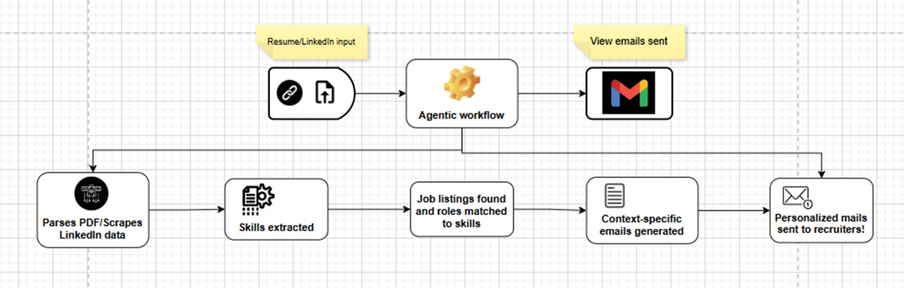

# WorklyAI

  
  <h3 align="center">AI-Agent Powered Job Application Automation</h3>
  
Streamline your job search with automated applications, personalized cover letters, and intelligent job matching.

  <a href="https://github.com/achalbajpai/workly/issues">Report Bug</a> • 
  <a href="https://github.com/achalbajpai/workly/issues">Request Feature</a>

## 📋 Overview

WorklyAI is your smart job search assistant — built to transform how candidates discover, match with, and apply for jobs. Our AI agent automates the entire application journey, from resume parsing to tailored cover letters and scheduled applications. Whether you're job hunting full-time or passively exploring, WorklyAI saves hours of manual effort while increasing your chances of landing the right opportunity.

## 🔄 End-to-End Workflow

  
  
<i>WorklyAI’s Intelligent, Automated Job Application Pipeline</i>

## ✨ Key Features

-  **Resume Processing** - Extract structured data from PDF resumes for optimized job matching
  
-  **Skills & Role Extraction** - AI-powered identification of candidate skills and suitable roles
  
-  **Job Matching** - Automatically find and prioritize jobs that match your skills and experience
  
-  **Personalized Applications** - Generate customized cover letters for each position
  
-  **Automated Scheduling** - Set up recurring job searches and applications on your preferred schedule
  
-  **All-in-One Dashboard** - Manage your entire job search process from a single interface!

## ⚙️ How It Works

WorklyAI streamlines the job application process through a simple workflow:

- **Upload Your Resume** — Our system analyzes your experience, skills, and qualifications

- **Let the AI Work** — Automatically matches your profile with real-time job listings

- **Generate Personalized emails** — Generates custom cover letters for each opportunity

- **Apply Automatically** — Schedule or automate your applications on your terms

## 🎥 Demo & Presentation

- 📽 Pitch Deck: View our Presentation <a href="https://docs.google.com/presentation/d/1d90wzoVTdEdjcmzfOovbgM4sdJ3Rm5ff/edit?usp=sharing&ouid=101931434682051416454&rtpof=true&sd=true">here</a>

- 🧠 Live Demo: Watch the Demo <a href="https://youtu.be/BkCEa4DRsmA">here</a>

## 📝 License

This project is licensed under the MIT License.

---

Made with ❤️ for job seekers everywhere, by team ILLmatics

